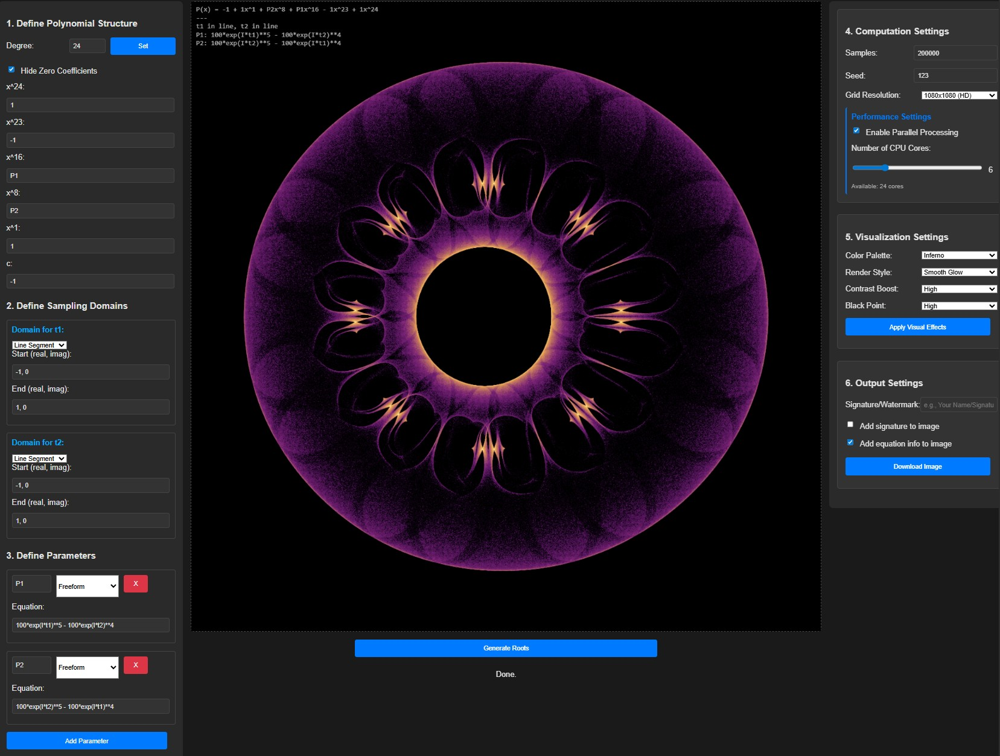

 

  

  <em>A research and art toolkit for visualizing polynomial roots on the complex plane</em>

 
 

---

 

## Mathematics as Image

*Polynomiogram.* The name combines polynomial with the suffix *-gram*, from the Greek *gramma*, meaning "something written or drawn." The same suffix appears in words such as spectrogram and phase diagram, which denote visual representations of mathematical or physical structures.

A Polynomiogram visualizes the global distribution of polynomial roots across parameterized families. The resulting images reveal how algebraic parameters shape collective root behavior, turning mathematical structure into both scientific and artistic form.

 

  

  <em>Generated root visualizations.</em>

 

---

 

## What's New in Version 3.0

### Modernized Interface
- **Clean, centered layout** with simplified header design
- **Dark/light theme toggle** with persistent preferences
- **Collapsible sections** (1-6) that remember state - all collapsed by default for a minimal look
- **Improved typography** with larger, clearer text hierarchy

### Enhanced User Experience
- **Stop button** to interrupt long computations mid-process
- **Fixed input focus bug** - no more losing focus when typing coefficients or exponents

### Better Workflow
- **Export metadata (JSON)** with complete configuration for reproducibility

 

---

 

## For researchers, artists, and educators

- *Exploring root geometry and complex dynamics*  
- *Creating math-driven visuals*  
- *Building demonstrations for students*

 

---

 

<table>
  <tr>
    <td width="55%" valign="top">
      <h2>Key capabilities</h2>
      <ul>
        <li>Unified environment for computing, visualizing, and interpreting polynomial roots</li>
        <li>Integrates symbolic parameterization, efficient numerical solvers, and density-based visualization</li>
        <li>Provides tools for exploration, hypothesis testing, and educational demonstration in polynomial research</li>
        <li>Extends naturally to artistic and creative design through customizable rendering</li>
      </ul>
       
      <h2>Getting started</h2>
      
<em>Requires 64-bit Windows</em>

      <ul>
        <li>Extract the repository</li>
        <li>Run <code>install.bat</code> to set up the local environment</li>
        <li>Run <code>start.bat</code> to launch the application</li>
      </ul>
       
      
<em>→ See the <a href="USER_GUIDE.md">User Guide</a> for detailed instructions</em>

    </td>
    <td width="45%" align="center" valign="top">
      
       
      <em>Application interface and controls.</em>
    </td>
  </tr>
</table>

 

---

  <em>Created with curiosity and code.</em>

 

  GPLv3+ • See <a href="LICENSE">LICENSE</a> for details

